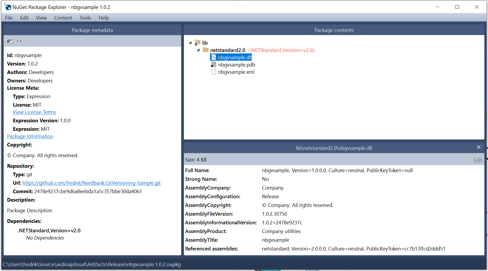

# Nerdbank.GitVersioning-Sample

A sample of how easy it is to adopt Nerdbank.GitVersioning to solve your versioning problems. 
This example also shows how to enable symbols and GitHub sourcelinking to your NuGet package.

## Create the NuGet

Run the command 
```bash
dotnet pack -c Release
```

The published NuGet package and its symbols will be under `Artifacts/Release`

## Explore the NuGet

You can use https://github.com/NuGetPackageExplorer/NuGetPackageExplorer to explore the NuGet package. 




## Useful links

* https://github.com/NuGetPackageExplorer/NuGetPackageExplorer
* https://docs.microsoft.com/en-us/dotnet/standard/library-guidance/versioning
* https://docs.microsoft.com/en-us/dotnet/standard/library-guidance/sourcelink
* https://docs.microsoft.com/en-us/dotnet/standard/library-guidance/publish-nuget-package
